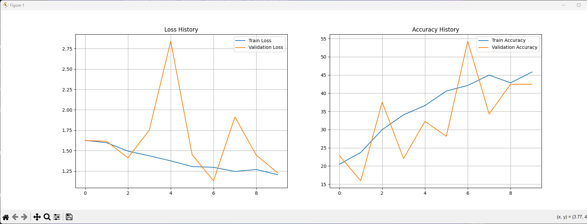

# Resnet-Exploration_300Gecs

<blockquote class="imgur-embed-pub" lang="en" data-id="2qmzniu"><a href="https://imgur.com/2qmzniu">View post on imgur.com</a></blockquote>

<blockquote class="imgur-embed-pub" lang="en" data-id="2Cc2pZl"><a href="https://imgur.com/2Cc2pZl">View post on imgur.com</a></blockquote>

<blockquote class="imgur-embed-pub" lang="en" data-id="1YHalql"><a href="https://imgur.com/1YHalql">View post on imgur.com</a></blockquote>

berikut adalah hyperparamter yang digunakan untuk komperasi antara 2 model (plain34 vs resnet34):
# Hyperparameters
    num_epochs = 10
    batch_size = 24
    learning_rate = 0.0005
    weight_decay = 0.0005

Pada saat mulai training, validation accuracy pada plain34 di epochs 1/10 22.86, kemudian turun menjadi 15.9% di epochs 2, sedangkan pada model resnet34 validation accuracy pada epochs 1 38.37%, dan mengalami penurunan hingga epochs 3 hingga menjadi 32.2%. Pada plain34 hanya mengalami kenaikan pada epochs 2 epochs saja, yaitu 3 dan 7 sedangkan pada resnet34 mengalami kenaikan pada epochs 4, 5, 6, dan 8. 

plain34
<blockquote class="imgur-embed-pub" lang="en" data-id="jczcNoN"><a href="https://imgur.com/jczcNoN">View post on imgur.com</a></blockquote>
<blockquote class="imgur-embed-pub" lang="en" data-id="pbg2Xpl"><a href="https://imgur.com/pbg2Xpl">View post on imgur.com</a></blockquote>

resnet34
<blockquote class="imgur-embed-pub" lang="en" data-id="fcpe8QK"><a href="https://imgur.com/fcpe8QK">View post on imgur.com</a></blockquote>
<blockquote class="imgur-embed-pub" lang="en" data-id="c9Gj8eT"><a href="https://imgur.com/c9Gj8eT">View post on imgur.com</a></blockquote>

Pada kedua gambar diatas dapat dilihat jika kenaikan nilai accuracy pada resnet34 lebih stabil jika dibandingkan dengan plain34, hal ini dikarenakan resnet terdapat skip connections. Skip connections memungkinkan gradien pada layer sebelumnya untuk melewati beberapa lapisan dan langsung ditambahkan ke lapisan yang lebih dalam. Skip connections tersebut yang membuat model resnet ini akurasinya terus meningkat selama training yang kita lakukan.

